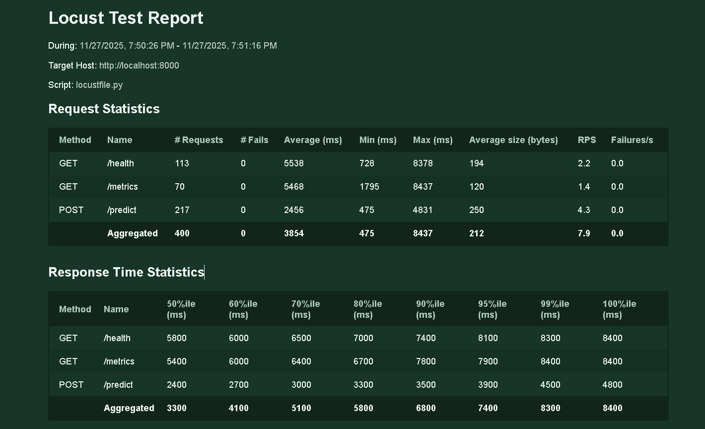
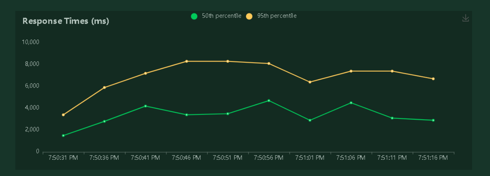
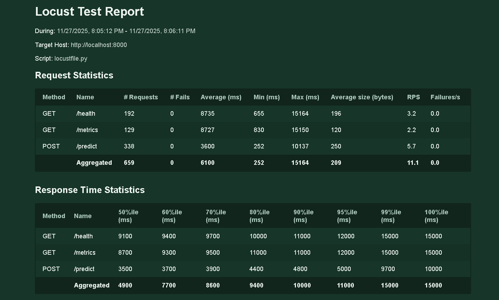
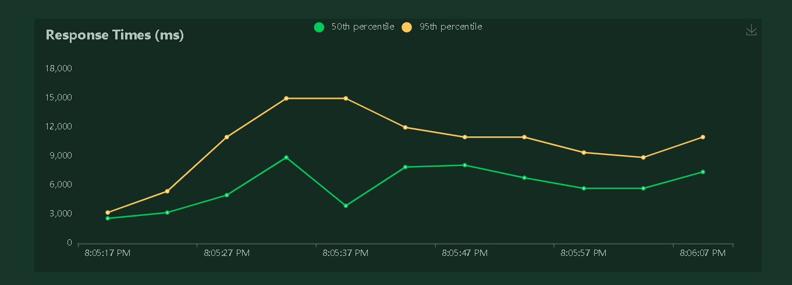

# land cover classification ml pipeline

ml deployment project for land cover classification using cnn

## video demo

[youtube link to be added]

## live deployment url

[aws url to be added after deployment]

## project description

this project implements an end-to-end ml pipeline for satellite image classification. the model classifies land cover into 9 categories: trees, shrubland, grassland, cropland, built-up areas, bare/sparse vegetation, water bodies, wetlands, and mangroves.

trained on esa worldcover 2021 satellite imagery from lagos, nigeria region.

based on original work: [lagos-urban-classification-ml-summative](https://github.com/dzuokumor/lagos-urban-classification-ml-summative)

## features

- single image prediction via web ui
- real-time monitoring dashboard with cpu/memory tracking
- data visualizations (pie charts, bar charts, confusion matrix)
- bulk data upload with validation
- model retraining capabilities with live progress
- rest api with fastapi
- react frontend with 5 specialized tabs
- docker containerization
- load testing with locust

## setup instructions

### local development

1. install python dependencies:
```bash
pip install -r requirements.txt
```

2. install frontend dependencies:
```bash
cd frontend
npm install
```

3. run the api:
```bash
python start_api.py
```

4. run the ui (separate terminal):
```bash
python start_ui.py
```

### docker deployment

1. build and run:
```bash
docker-compose up --build
```

2. access:
- api: http://localhost:8000
- ui: http://localhost:3000
- api docs: http://localhost:8000/docs

3. scale backend containers:
```bash
docker-compose up --scale api=2 -d
```

### load testing with locust

test the system under load with different container configurations:

```bash
# start docker containers
docker-compose up --build

# test with 1 container (50 users)
locust -f locustfile.py --host http://localhost:8000 --users 50 --spawn-rate 10 --run-time 60s --headless --html locust_report_1container.html

# scale to 2 containers
docker-compose up --scale api=2 -d

# test with 2 containers (100 users)
locust -f locustfile.py --host http://localhost:8000 --users 100 --spawn-rate 20 --run-time 60s --headless --html locust_report_2containers.html
```

results will be saved as html reports showing latency, requests/sec, and failures.

## project structure

```
land-cover-classification/
├── notebook/
│   └── model_evaluation.ipynb          # model evaluation and metrics
│
├── src/
│   ├── preprocessing.py                # image preprocessing utilities
│   ├── model.py                        # model architecture and training
│   └── prediction.py                   # prediction logic
│
├── api/
│   └── main.py                         # fastapi backend endpoints
│
├── frontend/
│   ├── public/
│   │   └── index.html
│   ├── src/
│   │   ├── components/
│   │   │   ├── Predict.js              # prediction interface
│   │   │   ├── Monitor.js              # system monitoring dashboard
│   │   │   ├── Visualizations.js       # data visualization charts
│   │   │   ├── Insights.js             # model insights and metrics
│   │   │   └── Retrain.js              # model retraining interface
│   │   ├── App.js                      # main app component
│   │   ├── App.css                     # global styles
│   │   └── index.js                    # react entry point
│   └── package.json
│
├── models/
│   ├── land_cover_model.h5             # trained model weights
│   └── class_indices.npy               # class mapping
│
├── data/
│   ├── training_data/                  # training dataset (9 class folders)
│   └── test/                           # test images for locust
│
├── requirements.txt                    # python dependencies
├── requirements-docker.txt             # docker-specific dependencies
├── Dockerfile                          # backend container definition
├── docker-compose.yml                  # multi-container orchestration
├── locustfile.py                       # load testing configuration
├── start_api.py                        # local api startup script
├── start_ui.py                         # local ui startup script
├── PROJECT_OVERVIEW.txt                # detailed project documentation
└── README.md                           # this file
```

## land cover classes

1. trees (10)
2. shrubland (20)
3. grassland (30)
4. cropland (40)
5. built-up (50)
6. bare/sparse vegetation (60)
7. permanent water bodies (80)
8. herbaceous wetland (90)
9. mangroves (95)

## api endpoints

- `GET /` - root endpoint
- `GET /health` - health check with cpu/memory metrics
- `GET /metrics` - prediction metrics (count, latency)
- `POST /predict` - single image prediction
- `POST /upload-bulk` - bulk data upload with validation
- `POST /retrain` - trigger model retraining
- `GET /training-logs` - get real-time training progress
- `GET /download-sample-dataset` - download sample training data

## load testing results

### test configuration

- test 1: 1 backend container, 50 concurrent users, 10 spawn rate
- test 2: 2 backend containers, 100 concurrent users, 20 spawn rate
- duration: 60 seconds each
- endpoints tested: /health, /metrics, /predict

### results summary

**test 1: single container (50 users)**
- total requests: 400
- requests per second: 7.9 rps
- average response time: 3854 ms
- 95th percentile latency: 7400 ms
- failure rate: 0% (0 failures)
- max response time: 8437 ms

endpoint breakdown:
- `/predict`: 2456 ms avg (217 requests)
- `/health`: 5538 ms avg (113 requests)
- `/metrics`: 5468 ms avg (70 requests)

**test 2: dual containers (100 users)**
- total requests: 659
- requests per second: 11.1 rps (+40% improvement)
- average response time: 6100 ms
- 95th percentile latency: 11000 ms
- failure rate: 0% (0 failures)
- max response time: 15164 ms

endpoint breakdown:
- `/predict`: 3600 ms avg (338 requests)
- `/health`: 8735 ms avg (192 requests)
- `/metrics`: 8727 ms avg (129 requests)

**performance analysis:**
- scaling to 2 containers increased throughput by 40% (7.9 → 11.1 rps)
- system handled 65% more total requests (400 → 659)
- zero failures across both tests demonstrates system stability
- prediction endpoint consistently faster than monitoring endpoints
- response times increased with higher load, expected behavior under stress

key metrics tracked:
- requests per second (rps)
- average response time (ms)
- 95th percentile latency
- failure rate
- concurrent users handled

### visual results

**test 1: single container (50 users)**

request statistics:


response times:


**test 2: dual containers (100 users)**

request statistics:


response times:



## model evaluation

see `notebook/model_evaluation.ipynb` for detailed analysis including:
- overall accuracy and classification report
- confusion matrix (normalized)
- per-class performance metrics
- confidence distribution analysis
- sample predictions with visualizations
- error analysis and common misclassifications
- model architecture summary

## tech stack

**backend:**
- python 3.11
- fastapi (rest api)
- tensorflow/keras (deep learning)
- pillow (image processing)
- psutil (system monitoring)
- uvicorn (asgi server)

**frontend:**
- react 18
- axios (http client)
- recharts (data visualization)
- modern responsive ui

**deployment:**
- docker & docker-compose
- multi-container orchestration
- volume persistence

**model:**
- convolutional neural network (cnn)
- input: 64x64x3 rgb images
- output: 9 class probabilities

## how to use

1. **predict**: upload satellite image → get land cover classification
2. **monitor**: view real-time system metrics and performance
3. **visualizations**: explore data distributions and model performance
4. **insights**: review model accuracy and class information
5. **retrain**: upload new training data → validate → retrain model
